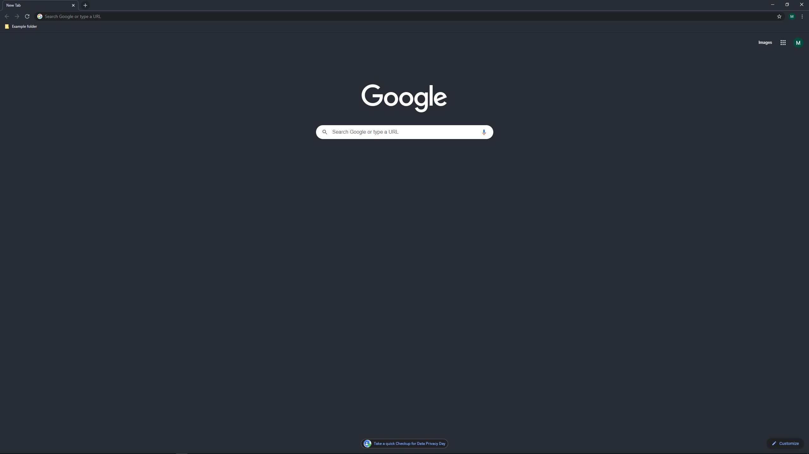

# chrome-one-dark

A theme for Chromium browsers based on [Atom's One Dark theme](https://github.com/atom/one-dark-ui).

### Installation Process
1. Go to `chrome://extensions`
2. Toggle "Developer mode" on
3. Click "Load unpacked"
4. Select the "chrome-one-dark" folder

### Example

